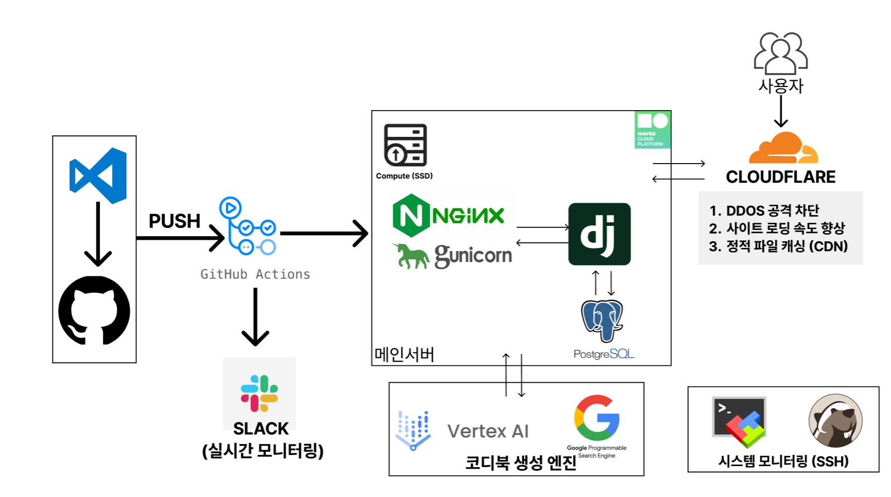

# 👕 Cody Now
> AI를 활용한 코디 추천 서비스
> [코디나우 바로가기](https://www.codynow.com/)

실시간 날씨 정보를 확인할 수 있어요. 
사용자 정보를 입력하고, 사진을 업로드하면  
AI가 맞춤형 코디 추천을 해줘요.

 

## 💻 Developers
* 프로젝트 기간 : 2025.01 - 2025.02 (4주)

| 담당자 | 역할 | 주요 업무 |
| :----: | :--: | --------- |
|  [홍다오](https://github.com/RRT3333) | PM | SEO, CI/CD 협업 슬랙 봇 개발 코디나우 추천 엔진 개발 |
|  [김예원](https://github.com/yeeeww) | FE/BE | 날씨 관련 기능 개발 나만의 옷장 및 카테고리 기능 개발 디자인, UX/UI 초기 배포 |
|  [박서정](https://github.com/Imggaggu) | FE/BE | AI 의류 분석 기능 개발 -LLM 재구성 및 API 연결 -UI/UX 검색기록 기능 개발 나만의 옷장 기능 기획 |
|  [최준혁](https://github.com/junhkchoi) | FE/BE | Allauth 활용한 소셜 로그인/회원가입 기능 구현 유저 프로파일링/모델 개발 코디추천 프롬포트 엔지니어링 SMTP 프로토콜을 활용해 가입성공 메일 전송하는 기능 구현 이미지 검색 기록 삭제, 더보기 기능 구현 |
|  [김은경](https://github.com/eunkyoung529) | FE/BE | 체험하기 기능 개발 나만의 옷장 히스토리 개발 검색기록 히스토리 개발 코디추천 프롬프트 엔지니어링|
 

## ✨ Feature

### 💁🏻‍♀️ 온보딩

* 온보딩에서는 성별과 나이, 선호 스타일을 선택합니다.

* 선택한 개인화 정보를 바탕으로 Ai가 코디를 추천해줍니다.
  
 

### 👕 코디 추천

* 옷 이미지를 업로드하면 Ai가 업로드된 옷 정보를 분석합니다.

* 업로드한 옷 정보와 개인화 정보 그리고 계절, 날씨 등을 고려해 Ai가 최적의 코디를 추천합니다.
  

 

### 🚪 나만의 옷장

* 업로드한 옷은 카테고리를 추가해 나만의 옷장에 넣을 수 있습니다.
  
* 나만의 옷장에서는 과거의 코디 추천 기록이나 옷 분석 정보를 확인할 수 있습니다.

 

## 🚀 Deploy 

 

## 🔀 Service Flow

 

## 🛠️ Tech Stack

 
