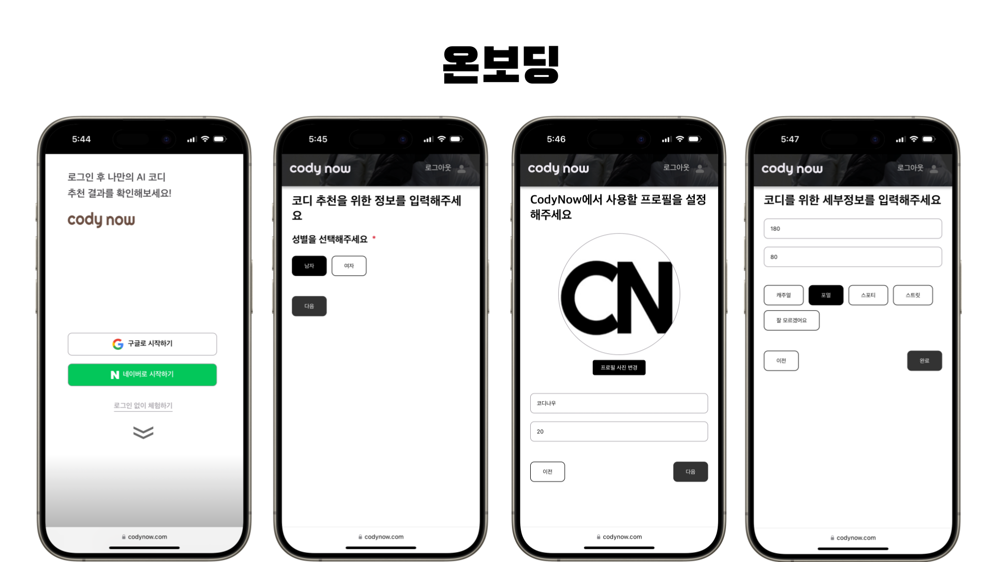
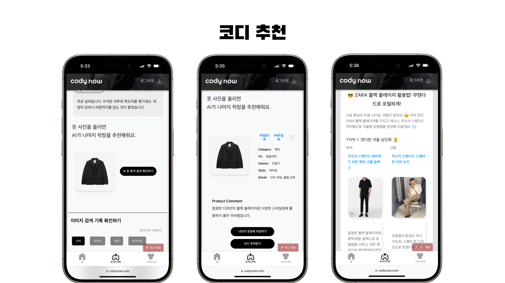
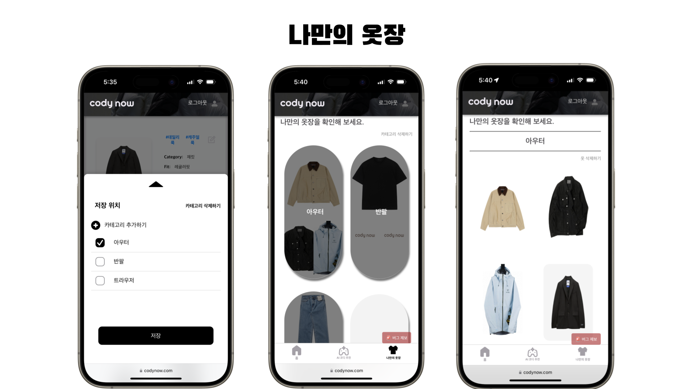
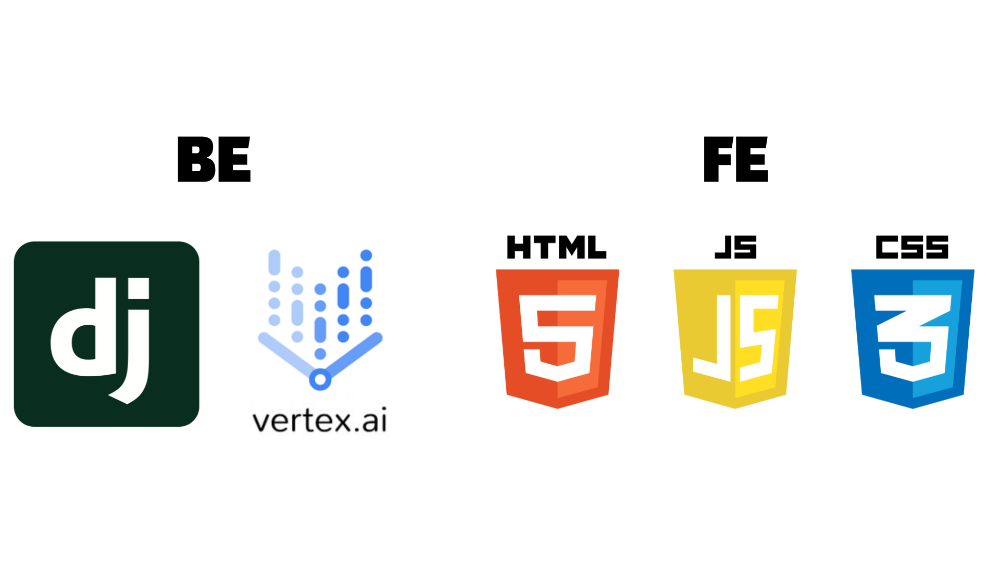

# 👕 Cody Now
> AI를 활용한 코디 추천 서비스
> [코디나우 바로가기](https://www.codynow.com/)

실시간 날씨 정보를 확인할 수 있어요. 
사용자 정보를 입력하고, 사진을 업로드하면  
AI가 맞춤형 코디 추천을 해줘요.

 

## 💻 Developers
* 프로젝트 기간 : 2025.01 - 2025.02

### FE & BE
|                    FE                    |                    BE                    |
| :--------------------------------------: | :--------------------------------------: |
|  [김예원](https://github.com/yeeeww)   [박서정](https://github.com/Imggaggu) |  [최준혁](https://github.com/junhkchoi)   [김은경](https://github.com/eunkyoung529) |

### PM
|                    PM                    |
| :--------------------------------------: |
|  [홍다오](https://github.com/RRT3333) |
 

## ✨ Feature

### 💁🏻‍♀️ 온보딩

 

### 🤖 코디 추천

 

### 🚪 나만의 옷장

 

## 🚀 Deploy 

 

## 🔀 Service Flow

 

## 🛠️ Tech Stack

 