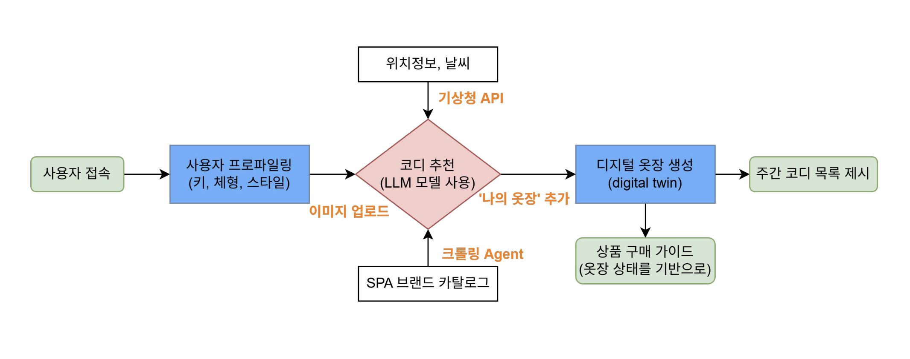

# 👕 Cody Now
> AI를 활용한 코디 추천 서비스


실시간 날씨 정보를 확인할 수 있어요.
사용자 정보를 입력하고, 사진을 업로드하면 
AI가 맞춤형 코디 추천을 해줘요.

## 💻 Developers
* 프로젝트 기간 : 2025.01 - 2025.02

|                                                                         FE                                                                         |                                                                         FE                                                                          |
| :------------------------------------------------------------------------------------------------------------------------------------------------: | :-------------------------------------------------------------------------------------------------------------------------------------------------: |
| <a href="https://github.com/yeeeww"></a> | <a href="https://github.com/Imggaggu"></a> |
|                                                       [김예원](https://github.com/yeeeww)                                                       |                                                       [박서정](https://github.com/Imggaggu)                                                       |

|                                                                        BE                                                                        |                                                                         BE                                                                         |
| :----------------------------------------------------------------------------------------------------------------------------------------------: | :------------------------------------------------------------------------------------------------------------------------------------------------: |
| <a href="https://github.com/junhkchoi"></a> | <a href="https://github.com/eunkyoung529"></a> |
|                                                       [최준혁](https://github.com/junhkchoi)                                                       |                                                       [김은경](https://github.com/eunkyoung529)                                                       |

|                                                                        PM                                                                        |
| :----------------------------------------------------------------------------------------------------------------------------------------------: |
| <a href="https://github.com/RRT3333"></a> |
|                                                       [홍다오](https://github.com/RRT3333)                                                       |


## ✨ Feature

### 온보딩

### 코디 추천

### 나만의 옷장

## Deploy


## Service Flow


## 🛠️ Tech Stack


## 의존성 목록 정리
```
의존성 목록
pip install django
pip install social-auth-app-django
pip install django-environ
pip install psycopg2-binary

pip install python-dotenv // 보안 이슈: 1월 29일에 추가
pip install django-allauth // 소셜 로그인 구현: 1월 29일에 추가

pip install Pillow // 이미지 저장 관련: 1월 29일에 추가
pip install google-generativeai requests pillow

pip install google-generativeai // 6번 기능 관련: 1월 29일에 추가
pip install google.ai.generativelanguage 

pip install google-genai

pip install six // 토큰 유효성 검사 관련: 1월 30일에 추가

pip install django-debug-toolbar

pip install Pillow pillow-heif //IOS 파일 처리: 2월 2일에 추가

pip install requests//커스텀 검색결과 (2/3)
pip install beautifulsoup4
pip install markdown2
```

## 컨벤션

### Commit Type

| Keyword | When to use |
| --- | --- |
| `feat` | 기능 관련 커밋 |
| `fix` | 버그 수정 |
| `add` | 내용을 추가하였을 때 |
| `chore` | 기타 변경 사항 |
| `docs` | 문서 수정 |
| `style` | 코드 formatting, 세미콜론 누락, 코드 자체의 변경이 없는 경우 |
| `refactor` | 코드 리팩토링 |
| `test` | 테스트 코드, 리팩토링 테스트 코드 추가 |
| `design` | CSS 등 사용자 UI 디자인 변경 |
| `comment` | 필요한 주석 추가 및 변경 |
| `rename` | 파일 또는 폴더 명을 수정하거나 옮기는 작업만인 경우 |
| `remove` | 파일을 삭제하는 작업만 수행한 경우 |
| `!BREAKING CHANGE` | 커다란 API 변경의 경우 |
| `!HOTFIX` | 급하게 치명적인 버그를 고쳐야 하는 경우 |
- 기능을 추가하거나 코드 수정하기 전 자주 커밋하기
- 주요 부분 완성할 때 마다 main에 merge 하여 자주 동기화
- Merge 할 때 마다 팀원들에게 전파하기

### Branch

| Branch 종류        | 설명             |
|---------------------|------------------|
| `main`              | 메인 브랜치      |
| `member's name`     | 담당 부분별 분업화 |
